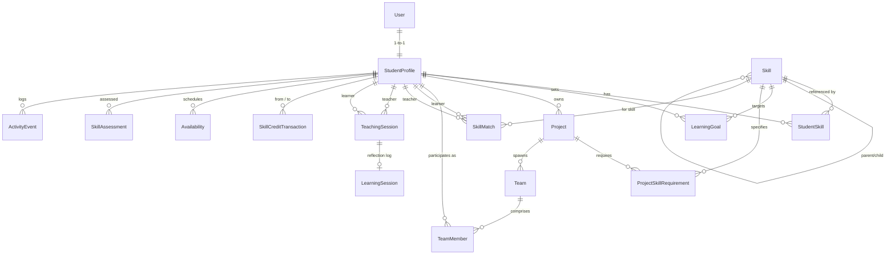

# AI Skill Exchange — Architecture Decision Record & System Design

## 1. Executive Summary

AI Skill Exchange is an offline-first, campus-wide platform connecting students based on complementary teaching and learning needs, project interests, and availability. Unlike traditional CRUD student directories, the system is driven by a **Skill Intelligence Engine** integrating semantic similarity, skill graph taxonomy, balanced team formation algorithms, and a decentralized skill credit economy.

---

## 2. Core Architecture Principles

1. **Natural Language Understanding**: Free-form student profiles and project briefs are analyzed to extract structured skills, proficiency, and prerequisites.
2. **Semantic Similarity & Recommendation**: Distance in embedding space pairs learners with ideal tutors even when terminology varies.
3. **Graph-Driven Taxonomy**: Skills form directed acyclic graphs (DAGs) representing dependencies, prerequisite chains, and cluster relations.
4. **Offline-First Resilience**: Zero dependency on a single cloud vendor. Fully functional locally using SQLite and mock/local AI providers, seamlessly swappable to PostgreSQL and cloud LLMs for online scale.
5. **Separation of Concerns**:
   - Presentation: Next.js + Tailwind + shadcn/ui
   - API / Domain Layer: FastAPI (async ASGI)
   - Source of Truth: SQLAlchemy 2.0 + SQLite / PostgreSQL
   - Intelligence: AI Engine Service Facade (modular provider pattern)

---

## 3. Database Entity Schema (Stage 1)

### Core Entities:
1. **`User`**: Authentication credentials, password hash, role (`STUDENT`, `FACULTY`, `ADMIN`).
2. **`StudentProfile`**: Bio, department, year of study, GitHub/portfolio links, and skill credit balance.
3. **`Skill`**: Canonical skill taxonomy with categories, descriptions, aliases, and parent-child hierarchy.
4. **`StudentSkill`**: Junction linking students to skills with direction (`TEACH`, `LEARN`), proficiency (`BEGINNER`, `INTERMEDIATE`, `ADVANCED`, `EXPERT`), and years of experience.
5. **`LearningGoal`**: Student-defined targets with target proficiency, deadline, and status (`NOT_STARTED`, `IN_PROGRESS`, `ACHIEVED`).
6. **`Project`**: Campus student initiatives seeking multi-disciplinary staffing.
7. **`ProjectSkillRequirement`**: Required or preferred skills with proficiency benchmarks.
8. **`Team` & `TeamMember`**: Multi-role team rosters (`LEAD`, `DEVELOPER`, `DESIGNER`, `RESEARCHER`, `CONTRIBUTOR`).
9. **`SkillMatch`**: Pre-computed and dynamically generated pairings between complementary students with match scores and reasoning explanations.
10. **`SkillCreditTransaction`**: Ledger tracking credit rewards, session payouts, and bonuses.
11. **`TeachingSession` & `LearningSession`**: Scheduled lessons, meeting links, attendance, and learner rating reflections.
12. **`Availability`**: Weekly recurring slots for peer tutoring.
13. **`SkillAssessment`**: Validated peer or faculty assessments.
14. **`ActivityEvent`**: Campus-wide milestone activity stream.

---

## 4. API Boundaries

The API adheres to RESTful patterns under `/api/v1/`:
- `/api/v1/auth`: Registration, JWT authentication, current user context
- `/api/v1/profiles`: Student discovery, search, profile details
- `/api/v1/skills`: Skill taxonomy, category aggregation, student skill declarations
- `/api/v1/learning-goals`: Target setting and progress tracking
- `/api/v1/projects` & `/api/v1/teams`: Collaboration proposals, staffing requirements, team rosters
- `/api/v1/matches`: Rule-based and AI complementary match generation
- `/api/v1/credits`: Atomic credit transfers, balances, transaction logs
- `/api/v1/sessions`: Teaching appointments, completion rewards, feedback logs
- `/api/v1/availabilities`: Tutoring calendar slots
- `/api/v1/assessments`: Proficiency validations
- `/api/v1/activities`: Campus timeline events

---

## 5. Offline-First Strategy

- **Zero-Cloud Local Default**: SQLite with WAL mode + in-memory mock AI provider allows students to run the entire backend and test suite with zero external cloud keys or internet access.
- **Provider Pattern**: Abstract interfaces (`LLMProvider`, `EmbeddingProvider`) allow swapping between:
  - `MockProvider` (deterministic regex + TF-IDF)
  - `OllamaProvider` (local offline LLM such as Llama 3 / Mistral)
  - `CloudProvider` (OpenAI / Anthropic / Gemini when online)
- **Database Engine Abstraction**: SQLAlchemy async engine switches between `sqlite+aiosqlite` and `postgresql+asyncpg` based purely on the `DATABASE_URL` environment variable.
